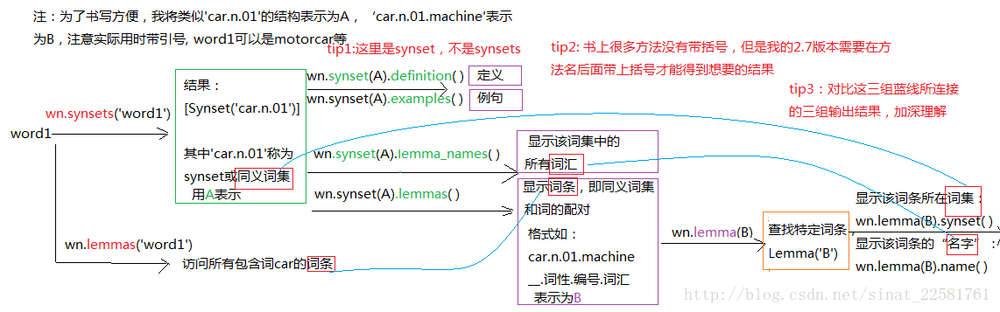

#### wordnet基本术语


1. 词集: synset, ex: car.n.01
2. 词条: lemma, ex: car.n.01.machine
3. 词汇: ex; car, auto ,automobile machine motorcar

```
# 词集：
>>> wn.synset('car.n.01')
Synset('car.n.01')

# 词条
>>> wn.synset('car.n.01').lemmas()
[Lemma('car.n.01.car'), Lemma('car.n.01.auto'), Lemma('car.n.01.automobile'), Lemma('car.n.01.machine'), Lemma('car.n.01.motorcar')]
# 词汇, (备注：没收录的也叫词汇)
>>> wn.synset('car.n.01').lemma_names()
[u'car', u'auto', u'automobile', u'machine', u'motorcar']

```


#### wordnet基本用法




1. 参数为一个 词汇 的方法
```
# 由词汇查找词集
>>> wn.synsets('motorcar')
[Synset('car.n.01')]

# 由词汇查找词条
>>> wn.lemmas('motorcar')
[Lemma('car.n.01.motorcar')]
# 由词汇查找词条
>>> wn.lemmas('car')
[Lemma('car.n.01.car'), Lemma('car.n.02.car'), Lemma('car.n.03.car'), Lemma('car.n.04.car'), Lemma('cable_car.n.01.car')]

```

2. 参数为一个 词集 的方法

```
# 找到词条: 是synset不是synsets
>>> wn.synset('car.n.01')
Synset('car.n.01')
# 定义
>>> wn.synset('car.n.01').definition()
u'a motor vehicle with four wheels; usually propelled by an internal combustion engine'
# 例句
>>> wn.synset('car.n.01').examples()
[u'he needs a car to get to work']

# 输出同义词集中的所有词汇
# 输出同义词集中的所有词汇
# 输出同义词集中的所有词汇
# 输出同义词集中的所有词汇
>>> wn.synset('car.n.01').lemma_names()
[u'car', u'auto', u'automobile', u'machine', u'motorcar']
# 输出同义词集中的所有词汇
# 输出同义词集中的所有词汇
# 输出同义词集中的所有词汇
# 输出同义词集中的所有词汇
>>> wn.synset('car.n.01').lemmas()
[Lemma('car.n.01.car'), Lemma('car.n.01.auto'), Lemma('car.n.01.automobile'), Lemma('car.n.01.machine'), Lemma('car.n.01.motorcar')]

```

3. 参数为一个 词条 的方法

```
# 显示所在词集
>>> wn.lemma('car.n.01.machine').synset()
Synset('car.n.01')
# 显示词条的名字(词汇)
>>> wn.lemma('car.n.01.machine').name()
u'machine'
```


