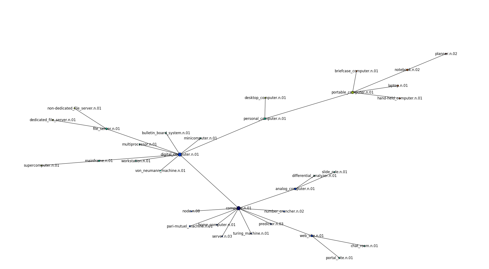
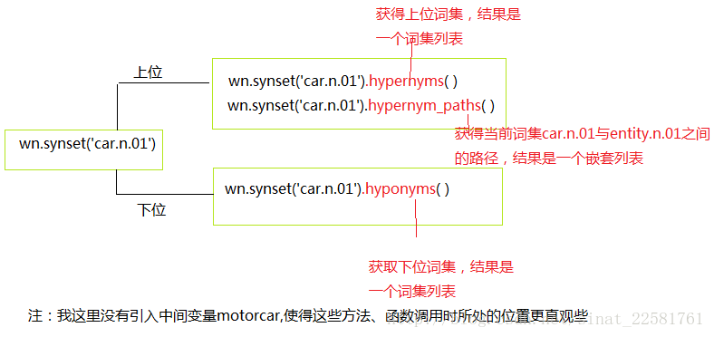

#### wordnet层次结构


[图的生成代码：computer.n.01为起点](./wordnet\_networkx.py)






```

上位词代表的范围大，下位词代表的范围小

# 词集：
>>> wn.synset('car.n.01')
Synset('car.n.01')

# 获取词集的所有词条
>>> wn.synset('car.n.01').lemmas()
[Lemma('car.n.01.car'), Lemma('car.n.01.auto'), Lemma('car.n.01.automobile'), Lemma('car.n.01.machine'), Lemma('car.n.01.motorcar')]
>>> wn.synset('car.n.01').lemma_names()
[u'car', u'auto', u'automobile', u'machine', u'motorcar']


# 查找词条
>>> wn.lemma('car.n.01.machine')
Lemma('car.n.01.machine')
# 该词条所在的词集
>>> wn.lemma('car.n.01.machine').synset()
# 显示该词条(词汇)的名字
Synset('car.n.01')
>>> wn.lemma('car.n.01.machine').name()
u'machine'


# 获取上位词集(列表)
wn.synset('car.n.01').hypernyms()
[Synset('motor_vehicle.n.01')]   # 机动车辆, 这里其实是两条路径,两个上位词，但相同所以保留一个

# 获取根上位词集
>>> wn.synset('car.n.01').root_hypernyms()
[Synset('entity.n.01')]


# 获取词集与entity.n.01之间的路径。结果是一个嵌套列表。
# 第二条路径 仅比 第一条路径 多了 Synset('vehicle.n.01')
>>> wn.synset('car.n.01').hypernym_paths()
[[Synset('entity.n.01'), Synset('physical_entity.n.01'), Synset('object.n.01'), Synset('whole.n.02'), Synset('artifact.n.01'), Synset('instrumentality.n.03'), Synset('container.n.01'), Synset('wheeled_vehicle.n.01'), Synset('self-propelled_vehicle.n.01'), Synset('motor_vehicle.n.01'), Synset('car.n.01')],  # 路径1
 [Synset('entity.n.01'), Synset('physical_entity.n.01'), Synset('object.n.01'), Synset('whole.n.02'), Synset('artifact.n.01'), Synset('instrumentality.n.03'), Synset('conveyance.n.03'), Synset('vehicle.n.01'){'车辆'}, Synset('wheeled_vehicle.n.01'), Synset('self-propelled_vehicle.n.01'), Synset('motor_vehicle.n.01'), Synset('car.n.01')]] # 路径2

# 获取第一条路径上所有词集的名字
>>> [synset.name() for synset in wn.synset('car.n.01').hypernym_paths()[0]]
[u'entity.n.01', u'physical_entity.n.01', u'object.n.01', u'whole.n.02', u'artifact.n.01', u'instrumentality.n.03', u'container.n.01', u'wheeled_vehicle.n.01', u'self-propelled_vehicle.n.01', u'motor_vehicle.n.01', u'car.n.01']


# 获取下位词集(列表)
>>> wn.synset('car.n.01').hyponyms()
[Synset('ambulance.n.01'), Synset('beach_wagon.n.01'), Synset('bus.n.04'), Synset('cab.n.03'), Synset('compact.n.03'), Synset('convertible.n.01'), Synset('coupe.n.01'), Synset('cruiser.n.01'), Synset('electric.n.01'), Synset('gas_guzzler.n.01'), Synset('hardtop.n.01'), Synset('hatchback.n.01'), Synset('horseless_carriage.n.01'), Synset('hot_rod.n.01'), Synset('jeep.n.01'), Synset('limousine.n.01'), Synset('loaner.n.02'), Synset('minicar.n.01'), Synset('minivan.n.01'), Synset('model_t.n.01'), Synset('pace_car.n.01'), Synset('racer.n.02'), Synset('roadster.n.01'), Synset('sedan.n.01'), Synset('sport_utility.n.01'), Synset('sports_car.n.01'), Synset('stanley_steamer.n.01'), Synset('stock_car.n.01'), Synset('subcompact.n.01'), Synset('touring_car.n.01'), Synset('used-car.n.01')]

# 查看索引为0,1的词集
>>> wn.synset('car.n.01').hyponyms()[0]
Synset('ambulance.n.01')
>>> wn.synset('car.n.01').hyponyms()[1]
Synset('beach_wagon.n.01')


# 获取词条(lemma): 注意：有的多，有的少
>>> wn.synset('car.n.01').hyponyms()[0].lemmas()
[Lemma('ambulance.n.01.ambulance')]
>>> wn.synset('car.n.01').hyponyms()[1].lemmas()
[Lemma('beach_wagon.n.01.beach_wagon'), Lemma('beach_wagon.n.01.station_wagon'), Lemma('beach_wagon.n.01.wagon'), Lemma('beach_wagon.n.01.estate_car'), Lemma('beach_wagon.n.01.beach_waggon'), Lemma('beach_wagon.n.01.station_waggon'), Lemma('beach_wagon.n.01.waggon')beach_wagon.n.01.waggon]


# 获取某个词集的下位词列表的词条列表的词条名词  # Model_T: 福特T型车. 第一款面向大众的车型
>>> [lemma.name() for synset in wn.synset('car.n.01').hyponyms() for lemma in synset.lemmas()]
[u'ambulance', u'beach_wagon', u'station_wagon', u'wagon', u'estate_car', u'beach_waggon', u'station_waggon', u'waggon', u'bus', u'jalopy', u'heap', u'cab', u'hack', u'taxi', u'taxicab', u'compact', u'compact_car', u'convertible', u'coupe', u'cruiser', u'police_cruiser', u'patrol_car', u'police_car', u'prowl_car', u'squad_car', u'electric', u'electric_automobile', u'electric_car', u'gas_guzzler', u'hardtop', u'hatchback', u'horseless_carriage', u'hot_rod', u'hot-rod', u'jeep', u'landrover', u'limousine', u'limo', u'loaner', u'minicar', u'minivan', u'Model_T', u'pace_car', u'racer', u'race_car', u'racing_car', u'roadster', u'runabout', u'two-seater', u'sedan', u'saloon', u'sport_utility', u'sport_utility_vehicle', u'S.U.V.', u'SUV', u'sports_car', u'sport_car', u'Stanley_Steamer', u'stock_car', u'subcompact', u'subcompact_car', u'touring_car', u'phaeton', u'tourer', u'used-car', u'secondhand_car']


```

